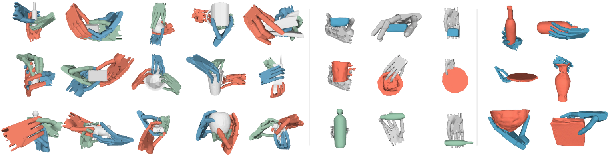

# UGG: Unified Generative Grasping

This repository contains PyTorch implementation of the paper "[UGG: Unified Generative Grasping](https://arxiv.org/abs/2311.16917)", ECCV 2024.

TL;DR: We present a unified modeling of hand-object interaction leverating diffusion model with our proposed *contact anchors* and *physics discriminator*.


*Figure: Left: grasp generation; Middle: object generation; Right: joint generation*

## Installation

### Training and Generation

This repository is developed on a machine with Ubuntu 20.04.4 LTS and CUDA 11.4.
To set up the required environment, follow these steps:

1. Create a new Anaconda environment named `ugg`:
    ```shell
    conda env create -f environment/environment.yaml
    conda activate ugg
    ```
2. Install third party resources:
    ```shell
    cd thirdparty/pytorch_kinematics
    pip install -e . && cd ..
    git clone https://github.com/wrc042/TorchSDF.git
    cd TorchSDF && git checkout 0.1.0 && pip install -e . && cd ..
    cd ../LION && python build_pkg.py
    ```

### Evaluation with IsaacGym

We recommend using Docker for evaluation with [IsaacGym](https://developer.nvidia.com/isaac-gym). Please download the [IsaacGym](https://developer.nvidia.com/isaac-gym) from the official source. Then, copy files under `environment/docker` to your download `isaacgym/docker` and build the docker.
```shell
cp environment/docker/* isaacgym/docker/
cd isaacgym/docker
sh build_isaac.sh
sh run_isaac.sh
```

## Datasets
We provide support for the [DexGraspNet Dataset](https://pku-epic.github.io/DexGraspNet/). To download the dataset, please refer to the dataset website. You may find the dataset split [here](https://github.com/PKU-EPIC/DexGraspNet/issues/4) or download the files with our model checkpoints below. The data to train the discriminator is also available below.

After processing the data, ensure that you have a folder named `data` with the following structure:
```
data
├── dexgraspnet
│   ├── core-bottle-1a7ba1f4c892e2da30711cdbdbc73924.npy
│   ├── ...
├── meshdata
│   ├── core-bottle-1a7ba1f4c892e2da30711cdbdbc73924/cocad
│   │   ├── coacd_convex_piece_0.obj
│   │   ├── ...
│   │   ├── coacd.urdf
│   │   ├── decomposed.obj
│   │   ├── ...
├── splits
│   ├── split_dexgraspnet_test.txt
│   ├── split_dexgraspnet_train.txt
│   ├── split_dexgraspobject_test.txt
│   ├── split_dexgraspobject_train.txt
├── discriminator_data
│   ├── ...
```

## Run the Experiment

To train hand VAE, run
```shell
python model/ugg/hand_vae.py --cfg experiments/ugg_hand_vae_train.yaml
```

To train UGG, run
```shell
python model/ugg/train_generation.py --cfg experiments/ugg_generation_train.yaml
```

To train physics discriminator, run
```shell
python model/ugg/discriminator/latent_discriminator.py --cfg experiments/ugg_discriminator_train.yaml
```

For inference, run
```shell
python model/ugg/eval_generation.py --cfg experiments/ugg_{TASK}_test.yaml
```
You may replace `{TASK}` by `obj2hand`, `hand2obj`, or `joint`. For simplicity, we only support single GPU inference here.

To evaluate the generation result, run
```shell
sh run_sim.sh
```

You may find all results under `results/PROJECT/MODEL_NAME`.

## Model Weights
To use the model, download the weight file [**here**](https://drive.google.com/drive/folders/1hcE9dDOv2Kx4UJTJhwbkhjexSZF98iJk?usp=sharing) and put the `checkpoints` folder under this main foler. Add following configuration to the configuration file:
```yaml
WEIGHT_FILE: checkpoints/ugg/ugg_bs8x256_lr0002_l2_cosine/ugg.ckpt
```

## FAQ
We list some potential problems encoutered by us and users in [faq](docs/faq.md). We recommend to read through it first and we welcome users to enrich it by opening issues.

## Licensing
- Files in the `LION/`, `hand_model_mjcf/`, and `open_ai_assets/` directories are licensed under their own license. The use of IsaacGym should follow the license from the official source. Check them out before using.
- The main project is licensed udner the MIT License.

## Acknowledgement

We would like to express our gratitude to the authors of the following repositories, from which we referenced code:

* [LION](https://github.com/nv-tlabs/LION)
* [DexGraspNet](https://github.com/PKU-EPIC/DexGraspNet/tree/main)
* [UViT](https://github.com/baofff/U-ViT/tree/main)

## Citation
If you find this repository useful in your research, please cite
```
@inproceedings{lu2024ugg,
    author = {Lu, Jiaxin and Kang, Hao and Li, Haoxiang and Liu, Bo and Yang, Yiding and Huang, Qixing and Hua, Gang},
    title = {UGG: Unified Generative Grasping},
    year = {2024},
    publisher = {Springer-Verlag},
    address = {Berlin, Heidelberg},
    booktitle = {Computer Vision – ECCV 2024: 18th European Conference, Milan, Italy, September 29–October 4, 2024, Proceedings, Part LXVII},
    pages = {414–433},
    numpages = {20},
    keywords = {Dexterous Grasping, Contact Representation, Generative Model},
    location = {Milan, Italy}
}
```
